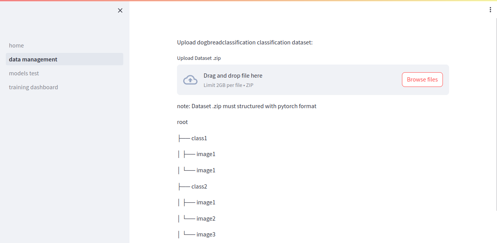
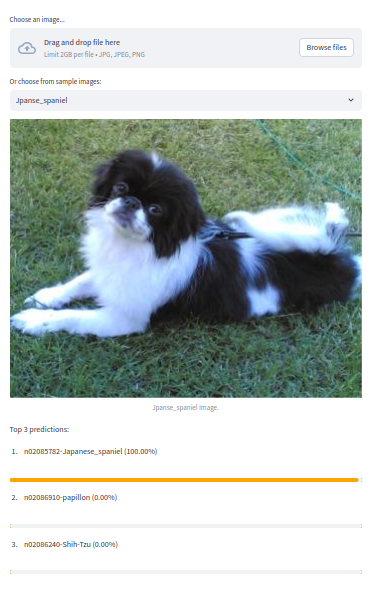
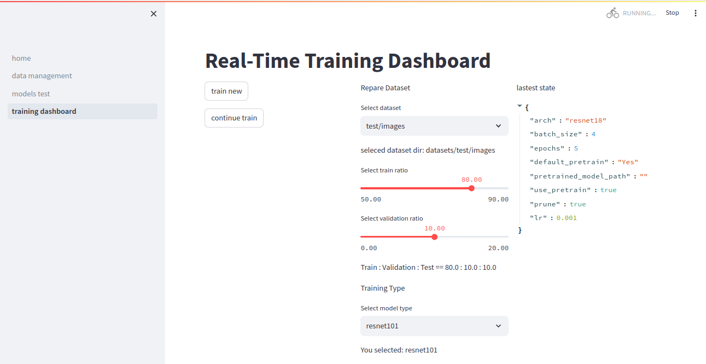
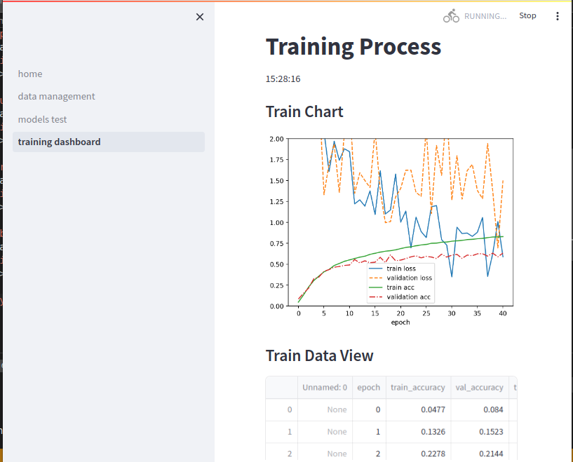
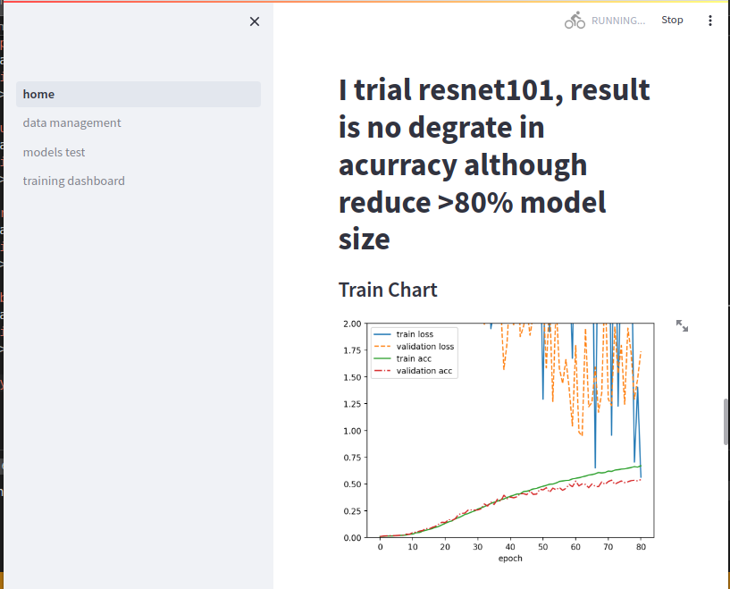
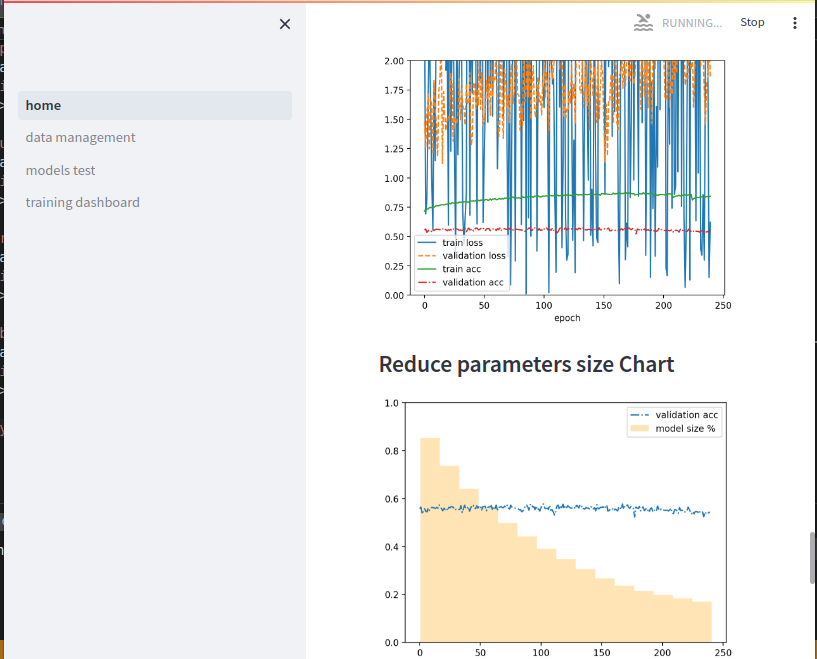
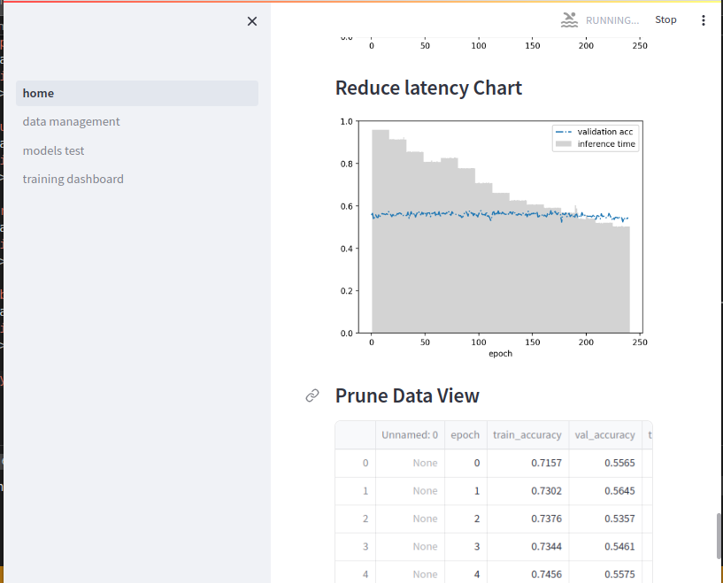

# dogbreadclassification

# clone
`git clone https://github.com/GloryVu/dogbreadclassification.git`

# create virtual env
`python3 -m venv dogbreadclassification`

# active venv

# install requirements
`cd dogbreadclassification`

`source bin/activate`

`pip install -r requirements.txt`

`pip install streamlit`

`cd classifier`

`python3 setup.py install`

`cd ../`
# run streamlit app
`streamlit run web/home.py --server.maxUploadSize 2048`
# upload your dataset in data management streamlit page

  

# run test on model test page

  

# train model in training dashboard page

  

# observe training progess  as well

  

# My discuss, trial results, news will be presented in home page

  

  

  

